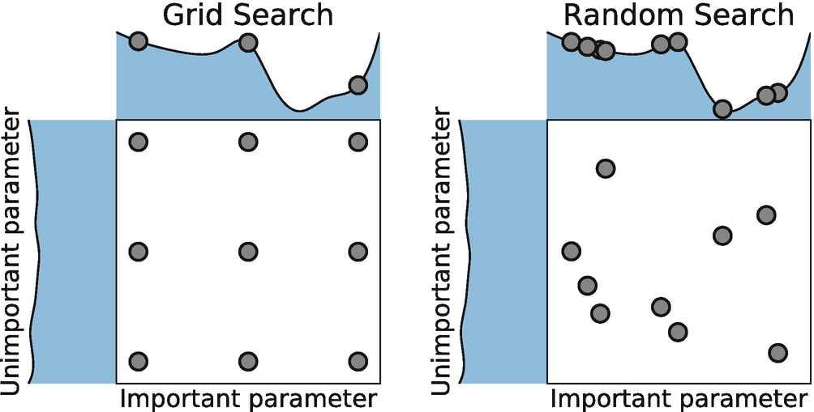

```{r knitr_init, echo = FALSE, results = "asis", cache = FALSE}
library(knitr)
library(rmdformats)

## Global options
options(max.print = "75")
opts_chunk$set(echo    = TRUE,
               cache   = FALSE,
               prompt  = FALSE,
               tidy    = FALSE,
               comment = NA,
               message = FALSE,
               warning = FALSE)
opts_knit$set(width = 75)
```

# Introduction

A model is a mathematical representation that may help to explain a system and to study the effects of different components, and to make predictions about behavior.

The modeling process follows through a number of steps:

1. Define the modeling objective
2. Obtain the data that would solve the modeling objective
3. Structure and cleaning the data
4. Feature Engineering
5. Modeling
6. Model validation

For this tutorial, we will consider a public dataset for auto insurance. To answer the first point above, the objective can be two-fold :

1. Predicting the likelihood that someone will claim (Frequency Model)
2. Predicting the cost of a claim if a claim occurs (Severity Model)

We will only consider the Frequency model for today.

By answering what type of person is more or less likely to claim, we can thereby know who should pay more or less for their insurance premium.

To answer the second point, in this case the data was obtained from an open source R library.

```{r fig.show = "hold", out.width = "100%", fig.align = "default", echo = FALSE}
knitr::include_graphics("dsLogo.png")
```

# Setup Code and Load Data

```{r}
options(scipen = 999)
library(tidyverse)
library(dplyr)
library(insuranceData)
library(caret)
library(pROC)
library(pdp)
library(MLmetrics)

data("dataCar")
dataCar
```

# Structure and cleaning the data {.tabset .tabset-fade}

Structuring the data in the correct way is the most important step to solve any modeling question. If the data isn't structured in the right way, any results from the model won't be reliable at all.

In the example below we see how a classical pricing database should be structured.

```{r fig.show = "hold", out.width = "100%", fig.align = "default", echo = FALSE}

```

The data in this example is already structured in a clean and clear way, however, we will perform some data cleaning in this step.

```{r}
lapply(dataCar, summary)
```

When we consider the data to clean, there is no hard and fast rules, but some ideas to look out for are :

1. Missing values in numeric features can be imputed with the mean/median or other advanced methods such as multiple imputation
2. Extreme values for numeric features can be excluded by capping and collaring 
3. Missing values in categorical features can be imputed with the mode
4. Categorical values can have lots of modalities (levels) and if so this will cause issues with the modeling part, this can be solved in a number of ways, but the simplest would be to group low-modal levels together as "other" and keep the top one seperately.

## Vehicle Value

This should not be 0 and there are some extremely high values that we can get rid of

```{r}
dataCar$veh_value %>% hist()
```

**Please note that this is a perfect example of when to ask questions. Vehicle values simply cannot be 0, so this could either mean that the data is missing or that we need to exclude these from the model, depending on what the reason for the 0's in the data is**

```{r}
midVal <- dataCar$veh_value %>% median()
dataCar <- dataCar %>%
  mutate(veh_value = ifelse(veh_value > quantile(veh_value, 0.999) | veh_value == 0, midVal, veh_value))
```

## Vehicle Body

The vehicle body is a categorical variable and as such we could have a situation where we have loads of modalities.

```{r}
dataCar$veh_body %>% unique() %>% length()
```

In this case 13 levels are not too much, so no grouping based on the number of modalities is necessary. However, it might be useful to perform the grouping based on the low levels.

```{r}
dataCar$veh_body %>% table() %>% prop.table()
```

Using intuition, we can see that BUS only represents 0.07% of the data, this will most likely not have much predictive power. We could fix this by grouping it with other variables and at the same time we can do the same with other vehicle groups. **Note this is personally selected and could potentially not make a lot of sense - this should be confirmed with experts**. There are also other ways of doing this, the most commonly known is clustering, which is an unsupervised technique.

```{r}
dataCar <- dataCar %>%
  mutate(veh_body = veh_body %>% as.character(),
         veh_body = ifelse(veh_body %in% c("BUS", "MIBUS", "TRUCK"),   "BUS_Class",   veh_body),
         veh_body = ifelse(veh_body %in% c("CONVT", "COUPE", "RDSTR"), "SPORT_Class", veh_body))
```

## X_OBSTAT_

This feature never changes (it always has the same value). Therefore it does not provide any useful information, we can simply remove it from the dataframe

```{r}
dataCar <- dataCar %>% select(-X_OBSTAT_)
```

# Feature Engineering

There is not much room for feature engineering in this example, but generally speaking this step includes things such as :

1. Extracting information from text (e.g. 'Mr. John', 'Mrs Jones' - here we can get the title and gender from the name)
2. Calculating time differences based on dates (e.g. date of birth, date of purchase = age of client)
3. Transforming data (a classic example is log-transformation of some variables, which creates a linear relationship between the variables - most relevant for linear models)

There is not right or wrong answer, but more a trial and error in this step, anything can be tested to see the impact on the model. This is where a lot of "art" happens.

# Modelling {.tabset .tabset-fade}

Modeling is really easy

```{r}
myFirstModel <- lm(dataCar$numclaims ~ dataCar$veh_value + dataCar$exposure + dataCar$veh_body + dataCar$veh_age + dataCar$gender + dataCar$area + dataCar$agecat)
```

That is it, we just trained our first model, in 1 line of code.

Is this a good model is a completely different question. We won't be going into a lot of modeling detail in this example, but rather just cover the basic steps in training a model.

## Target Variable

The target variable (or dependent variables) should never have missing values, if this occurs then we can simply ignore those rows of data where the target is missing. The same can be said for cases where the target variable behaves in ways that is not appropriate (imagine predicting house price and observing negative, zero or VERY small positive numbers).

In our case we are predicting the probability of someone claiming, keeping that in mind let's look at the data

```{r}
dataCar$clm %>% table() %>% prop.table()
```

```{r}
dataCar$numclaims %>% table() %>% prop.table()
```

In the first table we see if someone claimed or not, in the second we can see the number of times the person claimed (let's say in a year). In classical insurance frequency modeling this is modeled as a Poisson regression since this is a count model, where people could claim more than just once.

What is interesting to note here is in the first table where we only observe 6.8% of people claiming. This is known as an **unbalanced dataset**. What this means is that we observe a lot less 1's than 0's. We can already suspect that this won't be easy to model because of this imbalance. To understand this more broadly, imagine if I gave you all the data in the world would you have been able to predict the COVID-19 event occurring? Probably not, because this is such an incredibly rare event. On the other hand, if I ask you to predict someone's gender with all the data you could ever need, would this be possible? Yes, quite easily in-fact, you would mostly need, age, weight and height and you would relatively easily be able to say who is who.

There are ways of dealing with this unbalance (SMOTE is one of them), but we won't get into that now.

## Modelling Framework

The next step is to define the modeling framework, this is essentially defining the key variables for the model that we would be interested in.

```{r}
target <- "numclaims"
feats  <- c("veh_value", "veh_body", "veh_age", "gender", "area", "agecat")
expo   <- "exposure"
modDat <- dataCar[, c(target, feats, expo)]
```

You will see that we did not include 2 variables as features **clm** and **claimcst0** as these are known as **proxy variables**. Since we are modeling the claim count, if we use the variable **clm** which indicates if a claim occurred or not, then it would simply use the **clm** variable each time to predict the count and get the target almost perfectly predicted, similarly the **claimcst0**. We also separated the exposure variable from the features, this is done since we will add the exposure as a sort of weight to the model instead of a regular feature.

The classical definition of exposure in insurance is the amount of time the insurance company is exposed to an individual's risk. So if someone signed up for a policy on 1 Jan and we look at the policy at the end of June, the exposure would be 0.5. Meaning if someone with an exposure of 0.1 already had a claim vs someone with exposure of 0.9 then the claim associate with the 0.1 exposure should weight more.

## Dummy Variables

The next step is to create our dummy variables (or one-hot-encoding). This is basically giving character value a numeric representation

```{r}
modDatDummy <- modDat %>% dummyVars(formula = "~.", fullRank = F)
modDat      <- predict(modDatDummy, modDat) %>% as.data.frame()

names(modDat)
```
```{r}
modDat
```

## Train and Test

Before we start modeling we split the data into 2 or 3 groups :

1. The training set
2. The test set
3. The validation set

The training set is the data that we will use to train our model, we can go back and forth and "play" with this dataset as much as we want.

The test set is a data set used outside of the training set, this is "untouched" data and if the model predicts well on this dataset, then we know that the model is good.

The final dataset is the validation set, this is optional but highly recommended - depending on how much data you have. This is completely untouched data, how this is different to the test data is in the process. When we train and test we imperatively go back and forth between these two datasets and potentially creating a sort of artificially fit to the test data. The validation dataset is used right at the end to confirm the performance of the test and train set being stable

Why is this split important? Well, training a model on the full dataset will likely result in something called "overfitting" which is the occurance where the model predicts the training data really well, but does not generalize to unseen data. This splitting of the data solves the problem.

```{r fig.show = "hold", out.width = "100%", fig.align = "default", echo = FALSE}
knitr::include_graphics("overFitting.png")
```

You will see that we use `set.seed` at some parts in the code, this is simply to ensure reproducibility and should be used each time a random number is being generated. For more information on this topic please refer to [this link](http://www.datasciencemadesimple.com/generate-sample-set-seed-function-r/)

```{r}
set.seed(1988)
splitIndex <- createDataPartition(modDat[, target],
                                  p     = .75,
                                  list  = FALSE,
                                  times = 1)
trainDF <- modDat[splitIndex,  ]
testDF  <- modDat[-splitIndex, ]
```

## Parameter Optimization

After we set up the datasets, we then have to decide on the model form. There are many to choose from and each have their own advantages and disadvantages, here are a few model forms :

1. Generalized Linear Models
2. Random Forests
3. Gradient Boosting Models

These models can each solve different problems, such as :

1. Regression
2. Classification

These are also known as supervised learning models (where we have a target variable) as apposed to unsupervised learning models (no target variable - i.e. clustering).

Depending on the model form you choose, you will need to optimize the associated parameter set that comes with that model. We have chosen here to use a GBM, which is a very popular, effective and powerful model.

```{r}
objControl <- trainControl(method = "cv",
                           number = 3)
set.seed(42)
gbmGrid <- data.frame(interaction.depth = runif(100, 0 ,   5)    %>% round(0),
                      n.trees           = runif(100, 50,   1000) %>% round(0),
                      n.minobsinnode    = runif(100, 1,    100)  %>% round(0),
                      shrinkage         = runif(100, 0.01, 0.2)  %>% round(4)) %>%
  distinct()
```

## Actual Modelling

As shown at the start, the actual modeling step is not hard at all, it is preparing everything that goes into it that is hard.

We won't cover each parameter in detail, but here are the main ones :

1. Formula - This is the modeling formula, which is the target variable explained by the chosen explanatory variables (y ~ x1 + x2 + x3)
2. Distribution - This is the distribution/family to which the target variable belongs to (classification = binary, regression = gaussian, count = poisson)
3. Method - The method is the model form to choose from (glm, gbm, rf)
4. Metric - This is the loss function (logLoss, mse)
5. Train Control - This controls the training nuances (resampling, pre-processing)
6. Tuning Grid - This is the parameter search space - the bigger the space is the slower the training will be

```{r}
formFeats  <- names(trainDF)[names(trainDF) != target & names(trainDF) != expo]
frqFormula <- formula(paste0(target, " ~ ", paste0(formFeats, collapse = " + "), " + offset(log(", expo, "))"))

set.seed(2020)
objModel <- train(frqFormula,
                  data         = trainDF,
                  distribution = "poisson",
                  method       = "gbm",
                  metric       = "logLoss",
                  trControl    = objControl,
                  tuneGrid     = gbmGrid)
```

## Model Inspection

In this section we will inspect the model, please note that these are the key inspection steps, however there are other things to take into consideration.

We first look at the variable importance. This is the key variables that the model detected to predict the target.

```{r}
summary(objModel)
```

Here we can see that `veh_value` and `agecat` were identified as the most predictive variables.

We can also inspect the performance of the model as the number of trees increase, in the plot below, the blue line indicates the optimal number of trees to be fitted. Some implementations of the GBM model allows for early stopping, this can significantly speed up the training process. Please refer to [this link](https://www.kaggle.com/c/allstate-claims-severity/discussion/25963) for more information.

```{r}
gbm::gbm.perf(objModel$finalModel)
```

If we inspect the entire model, we will see the full output of each iteration. The last line specifies which model was selected.

```{r}
objModel
```
# Model Validation

In order to decide if the model is good, we need to evaluate the performance of this model. The first thing to note is that the definition of a good model is relative. Primarily, it is relative to what the benchmark is. Thus, if you have an existing model, the model evaluation metrics should be compared with the existing model. A metric, such as the Gini or RMSE on its own does not mean anything! Saying we have a Gini equal to 0.6 (higher being better) **does NOT imply a good or bad model**. However, with that said, we do know that a bad model is one with a Gini equal to 0.

We don't have a baseline model, so what we need to do is compare the prediction stability between the training and testing set :

```{r}
# Get predictions on your testing data
trainDF$pred <- predict(object = objModel, trainDF)

liftDatTrain <- data.frame(obs = trainDF$numclaims, pred = trainDF$pred) %>%
  arrange(-pred) %>%
  mutate(perc    = obs/sum(obs),
         obsCum  = cumsum(obs),
         predCum = cumsum(pred),
         n       = 100 * (1:nrow(.))/nrow(.))

giniTrain <- MLmetrics::NormalizedGini(y_pred = trainDF$pred, y_true = trainDF$numclaims)
rmseTrain <- RMSE(trainDF$pred, trainDF$numclaims)

liftDatTrain %>% 
  plotly::plot_ly(x   = ~n, y = ~obsCum,  type = 'scatter', mode = 'lines', name = "Observed") %>%
  plotly::add_lines(x = ~n, y = ~predCum, type = 'scatter', mode = 'lines', name = "Predicted") %>% 
  plotly::layout(title = "Train Data - Lift Curve",
                 xaxis = list(title = "Percentiles"),
                 yaxis = list(title = "Observed/Predicted")) %>%
  plotly::add_annotations(x         = 20,
                          y         = 2875,
                          text      = paste0("gini    = ", giniTrain %>% round(digits = 4)),
                          showarrow = FALSE) %>%
  plotly::add_annotations(x         = 20,
                          y         = 2750,
                          text      = paste0("RMSE = ", rmseTrain %>% round(digits = 4)),
                          showarrow = FALSE)
```

```{r}
# Get predictions on your testing data
testDF$pred <- predict(object = objModel, testDF)
liftDatTest <- data.frame(obs = testDF$numclaims, pred = testDF$pred) %>%
  arrange(-pred) %>%
  mutate(perc    = obs/sum(obs),
         obsCum  = cumsum(obs),
         predCum = cumsum(pred),
         n       = 100 * (1:nrow(.))/nrow(.))

giniTest <- MLmetrics::NormalizedGini(y_pred = testDF$pred, y_true = testDF$numclaims)
rmseTest <- RMSE(testDF$pred, testDF$numclaims)

liftDatTest %>% 
  plotly::plot_ly(x   = ~n, y = ~obsCum,  type = 'scatter', mode = 'lines', name = "Observed") %>%
  plotly::add_lines(x = ~n, y = ~predCum, type = 'scatter', mode = 'lines', name = "Predicted") %>% 
  plotly::layout(title = "Test Data - Lift Curve",
                 xaxis = list(title = "Percentiles"),
                 yaxis = list(title = "Observed/Predicted")) %>%
  plotly::add_annotations(x         = 20,
                          y         = 1075,
                          text      = paste0("gini    = ", giniTest %>% round(digits = 4)),
                          showarrow = FALSE) %>%
  plotly::add_annotations(x         = 20,
                          y         = 950,
                          text      = paste0("RMSE = ", rmseTest %>% round(digits = 4)),
                          showarrow = FALSE)
```

Here we can see that the Gini and RMSE are relatively close to one another. The Gini is a bit further away from the train set than hoped for, but it isn't too far. We can also see from the plot that the model tend to over-predict on the test set, which will lead to slightly more conservative results (which in insurance isn't a bad thing).


Finally, we take a look at partial dependence plots, these can be thought of as the impact that the model derives from each variable (on average) with respect to the response.

```{r}
pdp::partial(objModel, 
             pred.var    = "veh_value", 
             plot        = TRUE, 
             rug         = TRUE, 
             plot.engine = "ggplot2")
```

Clearly, the more expensive the vehicle becomes, the more higher the claim frequency becomes, there is an odd behavior around 6.8 - this might be due to low number of vehicles in this category and we might want to group them with another category.

```{r}
pdp::partial(objModel, 
             pred.var    = "agecat", 
             plot        = TRUE, 
             rug         = TRUE, 
             plot.engine = "ggplot2")
```

We can also see that as the age category increases, the risk of claiming decreases. This is a typical and expected result.

Some other things to consider :

1. Interaction between variables
2. Localized interpretation
3. Observed and Expected plots by variable separated for train and test sets

# Quck Glance at GBMs {.tabset .tabset-fade}

GBMs are made up of weak learners. What this means, is that it is a combination of models, each one slightly improving the previous one where the final result is a model which can very accurately predict the behavior of the underlying data.

## General Idea 

The first tree fit in the series is a single decision stump (i.e. a tree with a single split). Each successive decision stump thereafter is fit to the previous one’s residuals (errors). Initially there are large errors, but each additional decision stump in the sequence makes a small improvement in different areas across the feature space where errors still remain.

```{r fig.show = "hold", out.width = "100%", fig.align = "default", echo = FALSE}
knitr::include_graphics("gmb_steps.png")
```

The improvements between each step are done using a method called Gradient Descent.

## Gradient Descent

Gradient boosting is considered a gradient descent algorithm. Gradient descent is a very generic optimization algorithm capable of finding optimal solutions to a wide range of problems. The general idea of gradient descent is to tweak parameter(s) iteratively in order to minimize a cost function (loss function).  

Suppose you are a downhill skier racing your friend. A good strategy to beat your friend to the bottom is to take the path with the steepest slope. This is exactly what gradient descent does.

```{r fig.show = "hold", out.width = "100%", fig.align = "default", echo = FALSE}

```

Gradient Decent is controlled mainly with 2 parameters :

1. The learning rate
2. The number of steps (trees)

## Step Size Issues

If the learning rate is too big, we can end up "overshooting" the minimum, whereas if it is too small, we might never reach the minimum.

```{r fig.show = "hold", out.width = "100%", fig.align = "default", echo = FALSE}

```
Why not simply choose a small learning rate but increase the number of tress to be really big? Well, there are 2 reasons for this :

1. Time... The more trees you choose the longer it will take to train the model
2. Overfitting, if we set the trees to be very large and the learning rate small, we might end up learning the noise in the data

## Non-convex Issue

The final point to mention is that most often we won't be facing nice convex optimization issues as illustrated above. In reality, we will be faced with non-convex spaces, with many local minima and a single global minima.

```{r fig.show = "hold", out.width = "100%", fig.align = "default", echo = FALSE}

```

As illustrated above, there are 2 "paths" to take and they will both lead to different results - one local minima and then also the global minima. However, if the algorithm stared "heading" towards the local minima we would never be able to reach the global minima.

This problem becomes more complex with adding more variables.

There is no way we can solve this problem algorithmically, hence we can never guarantee that we have the best possible model. One way to solve this issues is by choosing a number of different starting points resulting in a large number of models and then choosing the model with the best results.

A solution to this problem is using a parameter search space. We can perform this search in many ways, but the most common forms of these searches are :

1. A Grid Search
2. A Random Search

```{r fig.show = "hold", out.width = "100%", fig.align = "default", echo = FALSE}

```

A grid search uniformly covers the entire search space, whereas a random search covers a wide range of values. 

With small data sets and lots of resources, Grid Search will produce accurate results. However, with large data sets, the high dimensions will greatly slow down computation time and be very costly. In this instance, it is advised to use Randomized Search since the number of iterations is explicitly defined by the data scientist.

## Conclusion

GBMs are very powerful, but it comes with its own set of problems. 

1. Interpretability
2. Implementation

A general issue with "advanced" ML algorithms is that they become more difficult to interpret and are widely considered as "black box models" where we imagine the computer is building a model with the human not knowing what exactly is being done. This interpretable issue is getting solved day-by-day, for a model-agnostic interpretation please refer to [this book](https://christophm.github.io/interpretable-ml-book/).

Linear models can easily be implemented in any IT system, as a prediction via a linear model is simply using a "rule-based" approach, where we load up a coefficient table and make our predictions via this table and some transformation (like exponentiate it, potentially). The implementation of GBMs is much more tricky, since a model is a combination of trees, each tree having a number of splits (these can individually be considered to be rule based). The solution to this problem is a little bit more technical, but easily solved in these days. We can use APIs to expose our models to an external environment (which in turn can call our model). You can learn more about APIs via R in [this article](https://github.com/rstudio/plumber).

For more information on GBMs please refer to [this link](https://bradleyboehmke.github.io/HOML/gbm.html) or search the internet for resources.


